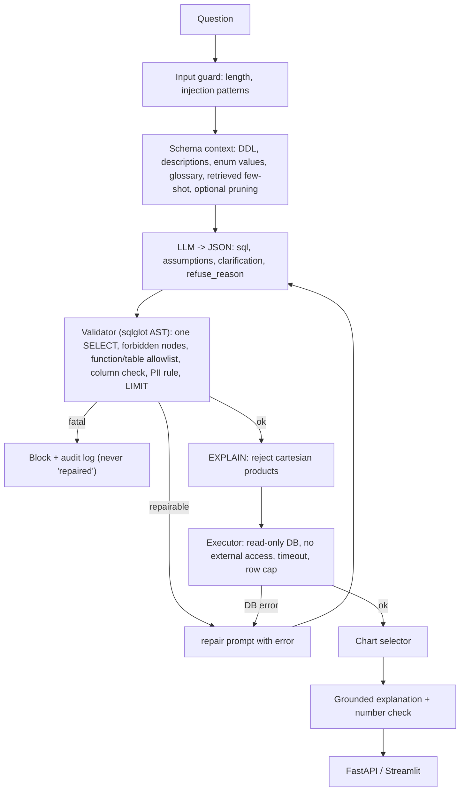

# Text-to-SQL Analytics Agent with rigorous evaluation

English question -> validated, read-only DuckDB SQL -> table + chart + grounded explanation, over the Olist Brazilian e-commerce
database (9 tables). The point of the repo is **measurement and safety**, not just a demo.

> **Status, stated plainly.** The system, guardrails, 80-question test set, eval harness, red-team suite, API, UI, Docker and CI are
> built and tested (95 tests). **No LLM was available when this was built, so every model-quality number (the ladder, ablations,
> judge, small-model row, Vanna baseline, error analysis) is blank on purpose.** Run the commands under "Reproduce" with an API key
> to fill them. Numbers below are only those a script in this repo produced.

## Architecture

Plain-Python state machine (`src/t2s/agent/pipeline.py`); no framework.

## Data and the traps it tests
Olist: `customer_id` is per order (use `customer_unique_id` for people), items x payments **fan-out** double counts revenue,
canceled/unavailable orders should be excluded from revenue, category names are Portuguese. These live in `schema/glossary.yaml`
and in dedicated test questions.

## Measured results (all produced by scripts in this repo)

**Test set:** 80 questions, 10 tiers (57 dev / 23 test), every gold SQL executes, is non-empty, and passes the validator;
11 were independently recomputed in pandas (`eval/verify_gold.py`). Max few-shot/eval similarity 0.62 (pool is disjoint).
Not yet done: blind human peer check of gold SQL.

**Guardrails, offline layer isolation** (`make redteam`; attack SQL is sent to each layer separately):
- 34 attacks evaluable offline across 12 categories, **34 defended**. 2 prompt-only attacks (poem, weather) need an LLM and are not counted.
- False positives: **0 of 88** benign SQL statements (gold + few-shot) rejected by the validator; **0 of 72** benign questions by the input guard.
- Layer breakdown (an attack can be caught by several layers): validator 27, database 21, input guard 4, plan check 1, timeout 2, row cap 1, prompt hygiene 2; 23 attacks were caught by 2+ layers.
- Honest weak spot: PII listing is caught only by the validator rule (the DB would happily return it, capped at 1000 rows). Prompt-only attacks outside the input-guard patterns depend on the LLM refusing.
- Caveat: attack SQL is hand-written to model what a manipulated generator could emit. It is not a measured attack-success rate against a live model; rerun with `--llm real` for that.

**Harness self-test (oracle LLM returns gold SQL):** 100% execution accuracy, 0 validator false-positive blocks, 0 hallucinated-schema flags. This validates
the comparator, executor, validator and plumbing. **It says nothing about model quality.**

| # | Configuration | Exec acc. | Valid-SQL | Halluc. schema % | Refusal acc. | p50 (s) | Tokens/q | $/q |
|---|---|---|---|---|---|---|---|---|
| 0 | Vanna baseline | | | | | | | |
| 1 | Zero-shot, raw DDL | | | | | | | |
| 2 | + descriptions, enums, glossary | | | | | | | |
| 3 | + retrieved few-shot | | | | | | | |
| 4 | + pruning | | | | | | | |
| 5 | + self-correction | | | | | | | |
| 6 | + guardrails (final) | | | | | | | |
| 6b | final, small open model | | | | | | | |

`python eval/run_ladder.py` regenerates `eval/results/ladder.md`; `python eval/plots.py` renders figures to `docs/figures/`.

## Safety design (three independent layers)
1. **Parser** (`guardrails/validator.py`): exactly one statement, root SELECT/UNION, forbidden node types, blocked functions/prefixes,
   no table functions or file paths, no schema-qualified names, table allowlist, column existence check, row-level PII rule, LIMIT injection. Fatal violations are blocked, never sent back to the LLM.
2. **Database** (`guardrails/executor.py`): `read_only=True`, `enable_external_access=false`, `lock_configuration=true`.
3. **Resource limits:** EXPLAIN cartesian-product rejection, interrupt timeout, `fetchmany` row cap, per-request cursor.
Plus: input guard, enum-value sanitising and free-text deny-list (prompt injection), `<data>` quoting in the explanation prompt, JSON audit log (`logs/audit.jsonl`).

## Reproduce
```bash
python -m venv .venv && . .venv/bin/activate && pip install -e ".[dev]"
./scripts/download_data.sh && python scripts/build_db.py        # DB from public CSV mirror
python eval/build_testset.py && python eval/verify_gold.py       # test set + independent verification
pytest -q                                                        # 95 tests, no LLM needed
make redteam                                                     # offline red-team + false-positive rate
python eval/run_eval.py --config configs/best.yaml --split all --llm oracle   # harness self-test
cp .env.example .env  # add GROQ_API_KEY (or use Ollama), then:
python eval/run_ladder.py --run --split dev                      # fills the ladder (LLM calls cached in .cache/llm)
python eval/run_ablations.py && python eval/plots.py
python eval/run_eval.py --config configs/best.yaml --split test  # ONCE, at the very end
python eval/redteam/run_redteam.py --llm real                    # end-to-end attack run
uvicorn t2s.api.app:app  &  streamlit run app/streamlit_app.py   # or: docker compose up --build
```
Without an API key the UI/API start in **demo mode**: only the curated sample questions are answered, with pre-written SQL that still passes through the validator and read-only executor (labelled as such in the UI).

## CI (`.github/workflows/ci.yml`)
Builds the DB, verifies gold, runs pytest, then a **pipeline regression gate** (oracle LLM; fails on a broken prompt or an over-blocking validator, proven by `tests/test_regression_gate.py`), the red-team gate, and, if `eval/cache_snapshot/` is committed, a cached-replay model-quality gate with thresholds in `eval/thresholds_model.json` (currently null: set them from your measured results minus a tolerance).
Honest nuance: with cached or oracle LLM responses CI tests the pipeline code, not model behaviour. Run real-call evals manually before releases.

## What's left (needs an LLM key, a human, or an account)
- Fill the ladder/ablations/judge calibration (hand-label 20-30 explanations, `eval/judge.py`), small-model row (`ollama pull qwen2.5-coder:7b`), Vanna baseline (`eval/baselines/vanna_baseline.py`, untested), optional Spider slice.
- `ERRORS.md` (needs real failures), blind peer check of 10 gold queries, 3-run variance on key configs.
- Verify `docker compose up --build` (Dockerfile/compose written, **not built or run** here), deploy to Hugging Face Spaces (keys in secrets; see below), record the demo video, write the blog post.
- Deployment notes: key only in platform secrets, `.env` is gitignored (run `gitleaks` before pushing); app has per-IP rate limit (20/min), daily cap (`T2S_DAILY_CAP`), 500-char question cap, row cap and timeout. The DuckDB file is ~52 MB: use Git LFS or load it from a HF Dataset.
- Embeddings: default is a dependency-free hashing embedder; `T2S_EMBEDDER=bge` uses `BAAI/bge-small-en-v1.5` (`pip install .[embed]`). Retrieval quality of the two is not compared yet.

## Layout
`src/t2s/{agent,guardrails,llm,viz,explain,api}`, `schema/` (descriptions + glossary), `prompts/`, `eval/` (testset, comparator, harness, red-team), `configs/` (one YAML per ladder step), `docs/` (eval policy, devlog, interview prep), `tests/`.
