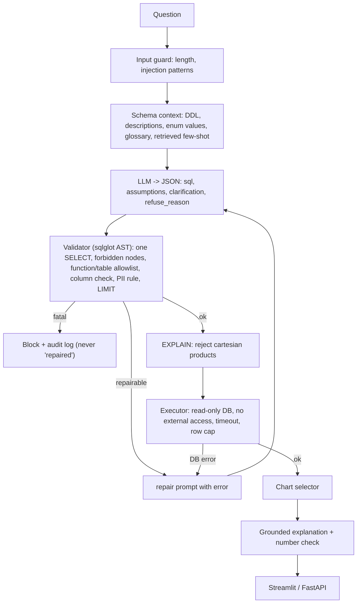

# Text-to-SQL Analytics Agent

Ask questions about data in plain English. The agent writes a **read-only SQL query**, checks it for safety, runs it, and shows you the **table, a chart, a plain-English explanation, the SQL, and the assumptions it made**.

It works on two kinds of data:
- **Built-in sample:** the Olist Brazilian e-commerce database (9 tables, ~100k orders).
- **Your own files:** upload CSV, Excel, Parquet or JSON in the UI and query them.

The repo also contains a rigorous evaluation setup (80-question test set, red-team attack suite, CI gates), because an unmeasured and unsafe Text-to-SQL demo proves little.

> **Honest status.** The app, guardrails, test set, eval harness, red-team suite, API, UI, Docker files and CI are built and tested (105 tests). **Model-accuracy numbers (the experiment ladder, ablations, LLM judge) have not been run yet**, so those tables are blank on purpose. Only numbers that a script in this repo produced appear below.

---

## 1. Quick start (5 minutes)

### What you need
| Need | Details |
|---|---|
| Python | 3.10 or newer (`python3 --version`) |
| Internet | once, to install packages and download the sample data (~45 MB) |
| An LLM API key | **optional but recommended.** Free keys: [Groq](https://console.groq.com/keys) or [Google AI Studio (Gemini)](https://aistudio.google.com/apikey). Without one the app runs in *demo mode* (see below) |

### Option A: one command (recommended)
```bash
git clone <your-repo-url> text-to-sql-agent
cd text-to-sql-agent
./scripts/quickstart.sh
```
This creates a virtualenv, installs dependencies, downloads the data, builds the database, creates `.env` for you, checks your setup, and starts the UI at **http://localhost:8502**.

If you have no key in `.env` yet, it still starts, in demo mode. Stop it (Ctrl+C), open the new `.env`, paste your key (next section), and run `./scripts/quickstart.sh` again. Use `./scripts/quickstart.sh --no-run` to set up and check without starting the UI.

### Option B: step by step
```bash
python3 -m venv .venv
source .venv/bin/activate                  # Windows: .venv\Scripts\activate
pip install -e ".[dev]"

./scripts/download_data.sh                 # downloads the 9 Olist CSVs into data/raw/
python scripts/build_db.py                 # builds data/db/olist.duckdb

cp .env.example .env                       # then edit .env and paste a key (section 2)
python scripts/check_setup.py              # tells you exactly what is missing
streamlit run app/streamlit_app.py         # opens http://localhost:8501
```
`scripts/download_data.sh` needs `bash` and `curl` (macOS/Linux; on Windows use WSL or Git Bash).

### Option C: no API key (demo mode)
Skip the `.env` step. The app still starts, but in **demo mode**: only the 7 sample questions in the sidebar work (their SQL is pre-written, still passes through the safety validator), and **uploading your own data is disabled** because that needs a model.

### Verify it works
```bash
python scripts/check_setup.py
```
Every line should say `[ok]`. If one says `[FAIL]` or `[WARN]` it prints the exact fix.

---

## 2. Configuration: what goes in `.env`

`.env` is a plain text file in the project root (copy from `.env.example`). It is **gitignored. Never commit it or share it.** Real environment variables (e.g. `export GROQ_API_KEY=...`) override the file. Lines starting with `#` are comments; empty values are ignored.

### The only thing you must set
Put **one** key in `.env` (two is fine):
```ini
GROQ_API_KEY=gsk_...your_key...
# and/or
GEMINI_API_KEY=...your_key...
```

### Full variable reference
| Variable | Required? | Default | What it does |
|---|---|---|---|
| `GROQ_API_KEY` | one of the keys | none | Key for Groq (the default provider) |
| `GEMINI_API_KEY` | one of the keys | none | Key for Google Gemini |
| `T2S_PROVIDER` | no | `groq` | Which provider the **app** uses: `groq`, `gemini`, `ollama`, `openai_compat` |
| `T2S_MODEL` | no | `openai/gpt-oss-120b` | Model name for that provider (see table below) |
| `T2S_FALLBACK` | no | none | `provider:model` tried automatically if the primary fails, e.g. `gemini:gemini-2.5-flash` |
| `OLLAMA_BASE_URL` | no | `http://localhost:11434/v1` | Where your local Ollama server is |
| `OLLAMA_API_KEY` | no | none | Only if your Ollama endpoint needs one |
| `OPENAI_BASE_URL`, `OPENAI_API_KEY` | only for `openai_compat` | none | Any OpenAI-compatible server |
| `T2S_DAILY_CAP` | no | `500` | Max requests the server answers per day (protects your quota on a public demo) |
| `T2S_MAX_UPLOAD_MB` | no | `50` | Max size per uploaded file |
| `T2S_MAX_DATASETS` | no | `20` | Uploaded datasets kept at once (oldest evicted) |
| `T2S_UPLOAD_DIR` | no | `.cache/uploads` | Where uploaded data is stored (deleted after 24 h) |
| `T2S_CACHE_DIR` | no | `.cache/llm` | Disk cache of LLM responses |
| `T2S_AUDIT_LOG` | no | `logs/audit.jsonl` | One JSON line per request |
| `T2S_CONFIG` | no | `configs/best.yaml` | Experiment config the app loads |
| `T2S_EMBEDDER` | no | hashing embedder | Set to `bge` to use `BAAI/bge-small-en-v1.5` (needs `pip install -e ".[embed]"`) |
| `T2S_API_URL` | no | none | If set, the Streamlit UI talks to the FastAPI backend at this URL instead of running in-process |

### Choosing a model
Model names change over time. List what your key can use:
```bash
# Groq
curl -s https://api.groq.com/openai/v1/models -H "Authorization: Bearer $GROQ_API_KEY" | python3 -c "import sys,json;print([m['id'] for m in json.load(sys.stdin)['data']])"
```
| Provider | Example `T2S_MODEL` | Notes |
|---|---|---|
| `groq` | `openai/gpt-oss-120b` (default, tested) | Reasoning model: accurate but some answers take 10-30 s |
| `gemini` | `gemini-2.5-flash` (tested) | Use `T2S_PROVIDER=gemini` |
| `ollama` | `qwen2.5-coder:7b` | Free and local: `ollama pull qwen2.5-coder:7b`, then `T2S_PROVIDER=ollama` |

Example `.env` that uses Gemini with Groq as the backup:
```ini
GEMINI_API_KEY=...
GROQ_API_KEY=...
T2S_PROVIDER=gemini
T2S_MODEL=gemini-2.5-flash
T2S_FALLBACK=groq:openai/gpt-oss-120b
```
Restart the app after editing `.env`.

---

## 3. Using the app

Start: `streamlit run app/streamlit_app.py` (port 8501) or `./scripts/quickstart.sh` (port 8502). Pick another port with `--server.port 8600`.

### Query the sample database
Choose **Olist e-commerce (sample data)** in the sidebar and click a sample question, or type your own, for example:
- *How many real customers placed more than one order?*
- *What are the top 10 English product categories by revenue?*
- *How are sales trending by month?*
- *Which customer states have the slowest deliveries?*

For each answer you get: a short explanation (numbers verified against the rows), a chart (switch Chart/Table and the chart type), the **SQL** (expand it), the **assumptions** the model made, and the self-correction attempts if the first query failed.

Things it should refuse or block: *"Drop the orders table"*, *"Read /etc/passwd with SQL"*, *"What was the profit margin?"* (the data has no costs), and listing individual customer identifiers.

### Query your own files
1. Sidebar -> **My uploaded data**.
2. Drop in files and click **Load data**. Accepted: `.csv .tsv .txt .xlsx .xls .parquet .json .jsonl` (up to 8 files, 50 MB each; each Excel sheet becomes a table).
3. Check the table list and previews in the sidebar, then ask questions.

What happens to your files:
- Loaded into an **isolated, read-only DuckDB file**; queries cannot modify them, read other files, or reach the sample database.
- Table and column names are normalised to `snake_case` (e.g. `Sales Amount` -> `sales_amount`) so the model can use them; the SQL shows the normalised names.
- Only renaming happens: **no data cleaning** (nulls, duplicates, spelling variants stay as they are).
- Columns that share a name and type across files (ending in `id`, `key`, `code`) are suggested as join keys.
- Uploads are deleted after 24 hours. They stay on the machine running the app.

Expect uploads to be **less reliable** than the sample data: the sample has hand-written column descriptions, business definitions and example queries; uploads give the model only table names, column names and types. Use clear, descriptive column names.

---

## 4. Other ways to run it

### FastAPI backend + UI (two processes)
```bash
uvicorn t2s.api.app:app --port 8000                       # terminal 1
T2S_API_URL=http://localhost:8000 streamlit run app/streamlit_app.py   # terminal 2
```
Endpoints: `GET /health`, `GET /samples`, `POST /ask` (`{"question": "...", "session_id": "...", "dataset_id": null}`), `POST /upload` (multipart `files`), `GET /datasets/{id}/preview/{table}`. Limits: 20 questions/min per IP, 6 uploads/min, 500-character questions. Interactive docs at `http://localhost:8000/docs`.

```bash
curl -s localhost:8000/ask -H 'content-type: application/json' -d '{"question":"How many sellers are there?"}'
```

### Docker
```bash
# the database must exist first (Option B, steps download_data.sh + build_db.py)
docker compose up --build        # API on :8000, UI on :8501; reads .env
```
The Dockerfile and compose file are written but **have not been build-tested yet**; report problems.

---

## 5. Troubleshooting

| Symptom | Cause and fix |
|---|---|
| `python scripts/check_setup.py` shows `[FAIL] Olist database` | Run `./scripts/download_data.sh && python scripts/build_db.py` |
| Sidebar says "no API key is configured" / app is in **demo mode** | `.env` is missing or the key line is empty. Run `cp .env.example .env`, paste the key, **restart** Streamlit |
| `LLM call failed: 404 Not Found` | The model name is wrong or retired. List models (section 2), set `T2S_MODEL` |
| `LLM call failed: 401` / `403` | Wrong or expired key; also check `T2S_PROVIDER` matches the key you set |
| `LLM call failed: 429` | Free-tier rate limit. Wait a minute, or set `T2S_FALLBACK` to a second provider |
| Answers take 30+ seconds | Reasoning models think first. Try `T2S_PROVIDER=gemini` + `gemini-2.5-flash` for speed |
| `Port 8501 is not available` | Another app uses it. Use `--server.port 8502` (or any free port) |
| Upload says "Could not read file" | Check the file opens normally; for CSV make sure there is a header row. Messy CSVs fall back to all-text columns |
| Chart missing | Charts need a numeric column plus a category or date column. Single numbers show as a metric; other results show as a table |
| "Blocked by validator" on a legitimate question | By design the sample database blocks row-level listing of customer identifiers (privacy). Ask an aggregated question instead |
| `ModuleNotFoundError` | Virtualenv not active: `source .venv/bin/activate`, then `pip install -e ".[dev]"` |
| `download_data.sh` fails | Needs `curl` and internet access. The CSVs come from a public Hugging Face mirror of the Kaggle dataset |

Still stuck? `python scripts/check_setup.py` output plus the last lines of the terminal running Streamlit usually pinpoint it.

---

## 6. How it works


A plain-Python state machine (`src/t2s/agent/pipeline.py`), no framework. The model returns structured JSON; if a sensible default exists it proceeds and states its assumptions, if the question is ambiguous it asks, and if the data can't answer it refuses.

**Olist traps the sample data tests:** `customer_id` is per order (people are `customer_unique_id`); joining items to payments double-counts revenue (fan-out); canceled/unavailable orders should be excluded from revenue; category names are Portuguese. These live in `schema/glossary.yaml` and in dedicated test questions.

### Safety: three independent layers
1. **Parser** (`guardrails/validator.py`): exactly one statement, root `SELECT`, forbidden statement types, blocked functions, no table functions or file paths, table allowlist, column existence check, row-level PII rule, `LIMIT` injection. Security violations are blocked and **never sent back to the model to "fix"**.
2. **Database** (`guardrails/executor.py`): `read_only=True`, `enable_external_access=false`, `lock_configuration=true`.
3. **Resource limits:** cartesian-product rejection via `EXPLAIN`, interrupt timeout (10 s), row cap (1000), per-request cursor.

Plus an input guard, sanitised sample values and a deny-list for free-text columns (prompt injection), `<data>` quoting in the explanation prompt, and a JSON audit log.

---

## 7. Evaluation

### What is measured (all produced by scripts here)
- **Test set:** 80 questions, 10 tiers, 57 dev / 23 test. Every gold SQL executes, is non-empty and passes the validator; 11 were independently recomputed in pandas. Few-shot pool is disjoint (max similarity to eval questions 0.62). **Not yet done:** a blind human peer check of the gold SQL.
- **Red team, offline layer isolation** (`make redteam`): 34 attacks testable without a model across 12 categories, **34 defended**; **0 of 88** benign SQL statements and **0 of 72** benign questions wrongly blocked. Layers that caught attacks: validator 27, database 21, input guard 4, plan check 1, timeout 2, row cap 1, prompt hygiene 2; 23 attacks were caught by 2+ layers. Two prompt-only attacks (poem, weather) need a model and are not counted. Caveat: attack SQL is hand-written to model a manipulated generator; it is not an attack-success rate against a live model.
- **Harness self-test** (oracle that returns the gold SQL): 100% / 0 false positives. Tests the plumbing and comparator, **not model quality**.
- **Observed once, informally:** with `openai/gpt-oss-120b`, "What was the profit margin?" was answered with an invented formula instead of refused (the schema has no cost data). This is exactly what the full evaluation should quantify.

### Not yet run (blank on purpose)
| # | Configuration | Exec acc. | Valid-SQL | Halluc. schema % | Refusal acc. | p50 (s) | Tokens/q | $/q |
|---|---|---|---|---|---|---|---|---|
| 0 | Vanna baseline | | | | | | | |
| 1 | Zero-shot, raw DDL | | | | | | | |
| 2 | + descriptions, enums, glossary | | | | | | | |
| 3 | + retrieved few-shot | | | | | | | |
| 4 | + schema pruning | | | | | | | |
| 5 | + self-correction | | | | | | | |
| 6 | + guardrails (final) | | | | | | | |
| 6b | final, small open model | | | | | | | |

### Reproduce / fill the table
```bash
python eval/build_testset.py && python eval/verify_gold.py        # test set + independent checks
pytest -q                                                         # 105 tests, no API key needed
make redteam                                                      # offline attack suite + false-positive rate
python eval/run_eval.py --config configs/best.yaml --split all --llm oracle     # harness self-test

python eval/run_ladder.py --run --split dev     # needs a key; fills the ladder (calls are cached in .cache/llm)
python eval/run_ablations.py                    # one-variable-at-a-time ablations
python eval/plots.py                            # figures into docs/figures/
python eval/error_analysis.py eval/results/step6_guardrails_dev.csv   # failure taxonomy for ERRORS.md
python eval/run_eval.py --config configs/best.yaml --split test       # ONCE, at the very end
python eval/redteam/run_redteam.py --llm real                         # attacks against the live model
```
Each ladder step is one file in `configs/` (model, prompt layers, retries, guardrails on/off). The scoring rules (column order, rounding, NULLs, ties, ambiguity) are in [`docs/eval_policy.md`](docs/eval_policy.md). The eval configs use the model in the YAML; `.env` overrides (`T2S_MODEL` etc.) affect only the app, so results stay reproducible.

---

## 8. Project layout
```
app/streamlit_app.py        UI (sample data + uploads + charts)
src/t2s/
  agent/                    pipeline, prompts, schema context, linking, few-shot, upload ingestion
  guardrails/               validator, executor, input guard, schema check
  llm/                      provider-agnostic client, cache, fallback
  viz/ explain/ api/        charts, grounded explanations, FastAPI + shared service
schema/                     table/column descriptions + business glossary (Olist)
prompts/                    few-shot pool, sample questions
eval/                       test set, comparator, harness, red team, ladder/ablation/plot scripts
configs/                    one YAML per experiment step
scripts/                    quickstart.sh, check_setup.py, download_data.sh, build_db.py
docs/                       eval policy, devlog, interview prep
tests/                      105 tests (validator, executor, comparator, pipeline with mock LLM, uploads, CI gate)
```
CI (`.github/workflows/ci.yml`) builds the DB, runs the tests, a pipeline regression gate (proven to fail on a broken prompt or an over-blocking validator) and the red-team gate. With cached/oracle responses CI tests pipeline code, not model behaviour.

## 9. Sharing and deploying
- **Never share `.env`** or paste keys in screenshots/issues. If a key leaks, rotate it in the provider console.
- Public demo: put keys in the host's secrets (e.g. Hugging Face Spaces); with no key the app safely falls back to demo mode. Use `T2S_DAILY_CAP`. Uploaded files are processed on the host, so only enable uploads where you accept that.
- **Data license:** Olist is CC BY-NC-SA 4.0 on Kaggle. The database file is gitignored; the scripts rebuild it from the public mirror. Check the license before publishing derived data.

## 10. What's left
Run the ladder/ablations and judge calibration (hand-label 20-30 explanations), small-model row (`ollama pull qwen2.5-coder:7b`), Vanna baseline (`eval/baselines/vanna_baseline.py`, untested), `ERRORS.md` from real failures, a blind peer check of 10 gold queries, a build-test of the Docker image, deployment, and the demo video. Optional: model-drafted column descriptions for uploads.
